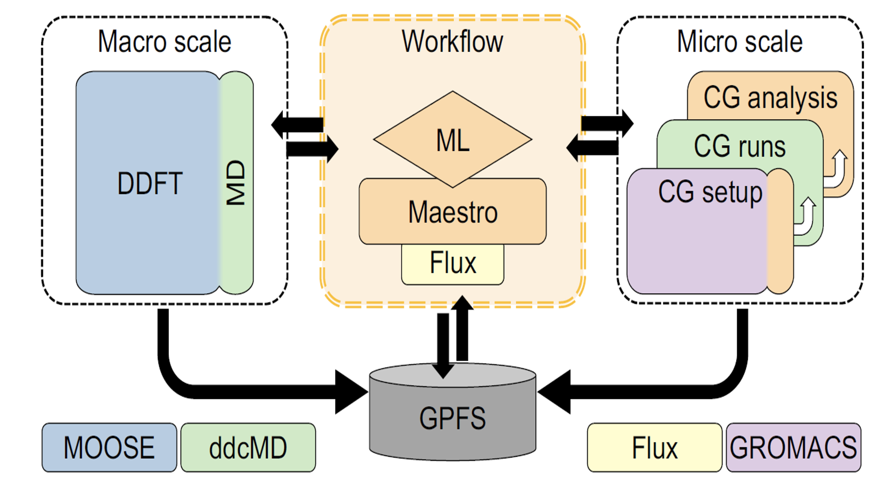

# NCI-DOE-Collab-Pilot2-MuMMI

## Description:

Multiscale Machine-learned Modeling Infrastructure (MuMMI) is a methodology that the Pilot 2 team has developed to study the interaction of active KRAS with the plasma membrane (and related phenomena) on very large temporal and spatial scales. To achieve this, MuMMI connects a macro model of the system to a micro model using machine-learning-based “dynamic importance sampling” implementing the workflow on world-class supercomputing resources. MuMMI was applied to a different biological system consisting of a new lipid bilayer into which a new type of protein is embedded.

MuMMI connects biological models of the membrane-protein system on two different scales:

1. A macro model based on the classical approximation theory for liquids in which 300 proteins (Modeled as single-particle beads) move around on a 1x1 &mu;m2 cross section of a perfectly flat (2D) plasma membrane.

2. A micro model that uses Martini coarse-grained (CG) molecular dynamics (MD) simulations to model a 30nm x 30nm “patch” of the macro model that necessarily contains at least one RAS protein.

**Figure 1:** MuMMI overview. MuMMI performs massively parallel multiscale simulations using an ML-driven sampling framework. The first layer is a macro scale (Dynamic Density Functional Theory (DDFT) model) with an overlaid MD simulations of RAS particles. 30 x nm2 patches are extracted from the 1 x 1 &mu;m2 macro snapshots and are simulated at the CG MD level. Each patch is run concurrently occupying available resources as much as possible.

## Software workflow:

MuMMI workflow manager (WM) is written in Python and uses a minimum of five nodes to run. The entire workflow is controlled via a configuration file with information on the machine requirement and frequencies of the tasks to be run. The workflow interfaces with Mastero that assits in query job status and to schedule new jobs when needed.

The workflow managers manages the state and execution of the framework, including:

1) **Generation of patches**: continuous polling of the running macro model simulation and generates patches from the incoming macro model snapshots (saved to disk) of the data resulting from the macro model simulation

    1) Several patches (spatial regions of scientific interest) are generated per snapshot, which are binary data files WM processes the snapshots as soon as            they are created
   
    2) At full scale, one snapshot is generated every 150 seconds and contains 300 patches
    
    3) Patches are stored as pickle objects in a tar archive file
    
2) **Selection of patches using ML**: patches are then passed to a pre-trained ML model (a deep neural network) that is used for online inference to evaluate patches for their configurational relevance, ranking all candidate patches correspondingly, using the top-ranked candidates to steer the target multiscale simulation toward CG simulations of scientific interest
  
    1) As new patches are generated, they are analyzed for their "importance" in real-time and are dynamically ranked in memory by this metric (using DynIm)
    
    2) This queue of patches is truncated
    
    3) The importance of a patch cannot increase over time
    
3) **Tracking system-wide computational resources**: This is done indirectly by tracking the tasks currently running and their known allocation size, using Maestro to query thy status of running jobs (previously started by the WM) from which the available resources (with and without GPU) are calculated

4) **Management of CG simulations**: monitoring available resources, starting new simulation tasks when resources become available (or during the loading phase of the workflow), monitoring running tasks (both CG setup and simulations), and restarting any jobs that fail due to hardware issues or simulation instability, providing extensive checkpointing and restoring capabilities

    1) Patches are selected from the priority queue to start new CG setup jobs based on need and to match available resources
    
    2) Completed CG setup systems are selected to run as new CG simulations
    
    3) The WM allows staggering scheduling of new jobs to reduce the load on the underlying scheduler, which is useful when executing large simulations on              several thousands of nodes.
  
5) **Feedback to the macro model from the micro model**: updating the macro model parameters, periodically (every two hours) collecting the accumulated RAS-lipid radial distribution functions (RDFs) from each CG simulation via data provided by the in situ analysis, gathering these metrics through the filesystem reading the RDFs for each CG simulation, aggregating them through appropriate weighting, and converting to the free-energy functionals needed for the macro model.

    1) To be clear, the data collected for generating feedback is from the results of the in situ analysis
    
    2) The filesystem is used for this (as opposed to memory), posing scalability challenges
    
    3) Macro model periodically reads in improved RDFs accumulated by the workflow via CG simulations and calculates Potential Mean Forces (PMFs) using the Ornstein-Zernike(OZ) and Hypernetted Chain closure(HNC) equations
    
6) **Checkpointing and restarting**: WM monitors all running jobs for dead jobs due to node failures, file corruption, File System (FS) failures, etc.
    
    1) Failed jobs are automatically restarted at the last available checkpoint
    
    2) In case the control data corrupts, all status files are duplicated
    
    3) The WM uses several checkpoint files to save the current state of the simulation in a coordinated manner, which can be used to restore the simulation,            potentially with different configurations or even on a different machine

## Suite Components:

1) **Maestro Workflow Conductor**: It is a Python-based workflow manager used in MuMMI that is used to run the macro model on partitions of the nodes, run inference on lipid patches in order to determine their importance, instantiate the CG setup jobs, spawn and track theCG simulations on the important patches, and run the in situ analysis. It interfaces with Flux in the backend. [GitHub Link](https://github.com/LLNL/maestrowf)

2) **Flux**:is the resource manager used for MuMMI that allows the workflow manager to break up the allocated nodes in custom, optimized ways. It is designed to be configured and run directly by the user inside of allocated jobs after they are optimally placed on the nodes by the scheduler. Flux assigns the jobs picked out in Maestro to the backend scheduler. MuMMI uses a Maestro plugin for Flux to allow WM’s interface to remain virtually independent of the ongoing development within Flux and to allow the option to switch schedulers in the future. [GitHub Link](https://flux-framework.github.io/)

3) **ddcMD**: It is Lawrence Livermore National Laboratory's (LLNL’s) own GPU-accelerated MD software that utilizes the Martini force field and it is faster than competitors such as AMBER, GROMACS, etc.  MuMMI uses ddcMD in two ways: 
   1) a CPU-only version of it is used to integrate protein equations of motion in the macro model and 
   2) a customized GPU (graphics processing unit) version of it is used for the micro model CG simulations utilizing the Martini force field. [ddcMD_GitHub Link](https://github/com/LLNL/ddcMD) and [ddcMD-utilities_GitHub Link](https://github/com/LLNL/ddcmdconverter)

4) **GridSim2D/Moose**: This is the finite element software implementing the equations of motion for the lipids within the dynamic density functional theory framework that is the larger part of the macro model, the other part of which is implemented using a CPU-only version of ddcMD to simulate the protein beads on the lipid membrane, which interact through potentials of mean force. [GitHub Link](??)

5) **DataBroker(DBR)**: was investigated for improving data management and I/O (Input/output) operations and allowing fast data storage and retrieval with database-level fault tolerance. [GitHub Link](https://github.com/LLNL/pytaridx)

6) **DynIm** is the dynamic importance sampling software that seems to interface with the MuMMI workflow manager (for running inference). [GitHub Link](https://github.com/CBIIT/NCI-DOE-Collab-Pilot2-DynIm)
 
7) **MemSurfer** is an analysis tool that is not used within the MuMMI workflow, is an efficient and versatile tool to compute and analyze membrane surfaces found in a wide variety of large-scale molecular simulations. [GitHub Link](https://github.com/CBIIT/NCI-DOE-Collab-Pilot2-MemSurfer)

**Figure 2:** MuMMI component scheme. MuMMI couples the macro scale (DDFT and MD) model with the micro scale (CG model) using a ML-based dynamic-importance sampling framework. Data resulting from the macro scale simulation is analyzed by ML, and interesting subregions are simulated at the micro scale. CG simulations are analyzed in situ and used to improve the macro model via on-the-fly feedback. The central workflow uses Flux as the resource manager, as abstracted using Mastero, and coordinates with each of teh software components using in-memory and on-disk communication. Modules in orange are the core, specially-developed components of the MuMMI framework, and other colors represent external software extended for MuMMI.  

## Requirements for MuMMI:

1) Initial macro model parameters (from CG training simulations)
   1) Radial distribution functions (RDFs) are taken from analysis of the Martini MD CG force field parameters and converted to free-energy functionals that are needed for the macro model
   2) Also needed from the CG simulations: lipid self-diffusion coefficients to get the mobility parameters for the macro model; potentials of mean force; direct correlation function; self-diffusion coefficients; protein diffusivity; initial protein conformations (this requires 30 CG MD simulations of standard patch size)
2) Ensure the CG (and macro) simulations are stable
3) Pre-training of model for encoding lipid configurations
4) Protein density on membrane
5) Initial library of protein conformations to sample from during CG simulations
6) Working Martini parameter set, structures of the proteins and lipids
7) Other physical parameters such as CG setup pull-protein-to-membrane speed, cut-off radii, etc.
8) Optimization of analysis routines so that using 3 CPU cores for each simulation it can keep up with the frequency of incoming frames from ddcMD
9) Crystal structure of active proteins in the lipid membrane context
10) Required experimental measurements
11) Biologically relevant membrane compositions and test of its stability in both models
12) Preparation of the lipid bilayer, e.g., lipid spacing in each leaflet
13) Modeled and optimized (minimized + equilibrated) protein
14) CG beads version of the protein structure calculated using martinize.py
15) CG-modeled/parametrized protein with all sanity checks
16) "Extensive sets of CG simulations were carried out in order to 
     1) validate the behavior of mixed lipid systems with and without RAS, as well as to 
     2) provide input parameters for the macro model" resulting in "preliminary CG simulation data" or "CG MD Martini parameterization simulations" or "training data"
    
    These result in these parameters to the macro model:
      1) diffusion coefficients for the different lipids
      2) diffusion coefficients for RAS in the two different orientational states
      3) lipid-lipid correlation functions
      4) potentials for lipid-RAS and RAS-RAS interactions
      5) state change rates for RAS
17) HMM analysis to determine orientational states of the protein
      1) They found RAS is generally in two metastable states in the macro model and three states in the micro model
18) Hyperparameter optimization (HPO) and data augmentation (rotations) on the variational autoencoder (VAE) model to work for the data for the particular biological system
19) Use MemSurfer to perform basic analysis of membrane simulations (e.g., local areal densities) in preparation for creating a macro model from CG MD data

## User Community:
Experienced data scientists, computational scientists, artificial intelligence researchers, clinical researchers, and all researchers dealing with sensitive data assets.

## Reference:
Refer to this [publication](https://www.researchsquare.com/article/rs-50842/v1) for more details.

## License:

This work is licensed under a CC BY 4.0 License. 

## Authors: 
| Name | Organization | ID |
| ------------- | ------------- | ------------- |
| Helgi Ingolfsson | Lawrence Livermore National Laboratory | ORCiD: https://orcid.org/0000-0002-7613-9143 | 
| Chris Neale | Theoretical Biology and Biophysics Group, Los Alamos National Laboratory, Los Alamos, NM. | | 
| Timothy Carpenter | Lawrence Livermore National Laboratory | ORCiD: https://orcid.org/0000-0001-7848-9983 | 
| Rebika Shrestha | RAS Initiative, The Cancer Research Technology Program, Frederick National Laboratory, Frederick, MD. | | 
| Cesar Lopez | Los Alamos National Laboratory | | 
| Timothy Tran | Frederick National Laboratory for Cancer Research | | 
| Tomas Oppelstrup | Lawrence Livermore National Laboratory | | 
| Harsh Bhatia | Computing Directorate, Lawrence Livermore National Laboratory, Livermore, CA. | | 
| Liam Stanton | Department of Mathematics and Statistics, San José State University, San José, CA. | | 
| Xiaohua Zhang | Physical and Life Sciences (PLS) Directorate, Lawrence Livermore National Laboratory, Livermore, CA. | ORCiD: https://orcid.org/0000-0003-0102-6352 | 
| Shiv Sundram | Physical and Life Sciences (PLS) Directorate, Lawrence Livermore National Laboratory, Livermore, CA. | | 
| Francesco Di Natale | Lawrence Livermore National Laboratory, Livermore, CA. | ORCiD: https://orcid.org/0000-0002-1954-170X | 
| Animesh Agarwal | Theoretical Biology and Biophysics Group, Los Alamos National Laboratory, Los Alamos, NM. | | 
| Gautham Dharuman | Physical and Life Sciences (PLS) Directorate, Lawrence Livermore National Laboratory, Livermore, CA. | | 
| Sara Kokkila Schumacher | Data Centric Systems, IBM T.J. Watson Research Center, Yorktown Heights, NY. | | 
| Thomas Turbyville | RAS Initiative, The Cancer Research Technology Program, Frederick National Laboratory, Frederick, MD. | | 
| Gulcin Gulten | RAS Initiative, The Cancer Research Technology Program, Frederick National Laboratory, Frederick, MD. | | 
| Que Van | RAS Initiative, The Cancer Research Technology Program, Frederick National Laboratory | ORCiD: https://orcid.org/0000-0002-2919-7375 | 
| Debanjan Goswami | RAS Initiative, The Cancer Research Technology Program, Frederick National Laboratory, Frederick, MD. | | 
| Frantz Jean-Francios | RAS Initiative, The Cancer Research Technology Program, Frederick National Laboratory, Frederick, MD. | | 
| Constance Agamasu | RAS Initiative, The Cancer Research Technology Program, Frederick National Laboratory, Frederick, MD. | | 
| De Chen | RAS Initiative, The Cancer Research Technology Program, Frederick National Laboratory, Frederick, MD. | | 
| Jeevapani Hettige | Theoretical Biology and Biophysics Group, Los Alamos National Laboratory, Los Alamos, NM. | | 
| Timothy Travers | Theoretical Biology and Biophysics Group, Los Alamos National Laboratory, Los Alamos, NM. | | 
| Sumantra Sarkar | Center for Nonlinear Studies, Los Alamos National Laboratory, Los Alamos, NM. | | 
| Michael Surh | Physical and Life Sciences (PLS) Directorate, Lawrence Livermore National Laboratory, Livermore, CA. | | 
| Yue Yang | Physical and Life Sciences (PLS) Directorate, Lawrence Livermore National Laboratory, Livermore, CA. | | 
| Adam Moody | Computing Directorate, Lawrence Livermore National Laboratory, Livermore, CA. | | 
| Shusen Liu | Lawrence Livermore National Laboratory | | 
| Brian Van Essen | Computing Directorate, Lawrence Livermore National Laboratory, Livermore, CA. | | 
| Arthur Voter | Theoretical Division, Los Alamos National Laboratory, Los Alamos, NM. | | 
| Arvind Ramanathan | Computing, Environment & Life Sciences (CELS) Directorate, Argonne National Laboratory, Lemont, IL. | | 
| Nicolas Hengartner | Los Alamos National Laboratory | | 
| Dhirendra Simanshu | RAS Initiative, The Cancer Research Technology Program, Frederick National Laboratory, Frederick, MD. | | 
| Andrew Stephen | RAS Initiative, The Cancer Research Technology Program, Frederick National Laboratory, Frederick, MD. | | 
| Peer-Timo Bremer | Computing Directorate, Lawrence Livermore National Laboratory, Livermore, CA. | ORCiD: https://orcid.org/0000-0003-4107-3831 | 
| S Gnanakaran | Los Alamos National Laboratory | ORCiD: https://orcid.org/0000-0002-9368-3044 | 
| James Glosli | Physical and Life Sciences (PLS) Directorate, Lawrence Livermore National Laboratory, Livermore, CA. | | 
| Felice Lightstone | Physical and Life Sciences (PLS) Directorate, Lawrence Livermore National Laboratory, Livermore, CA. | | 
| Frank McCormick | University of California, San Francisco | | 
| Dwight Nissley | RAS Initiative, The Cancer Research Technology Program, Frederick National Laboratory, Frederick, MD. | ORCiD: https://orcid.org/0000-0001-7523-116X | 
| Frederick Streitz | Physical and Life Sciences (PLS) Directorate, Lawrence Livermore National Laboratory, Livermore, CA. | ORCiD: https://orcid.org/0000-0003-0924-037X | 
