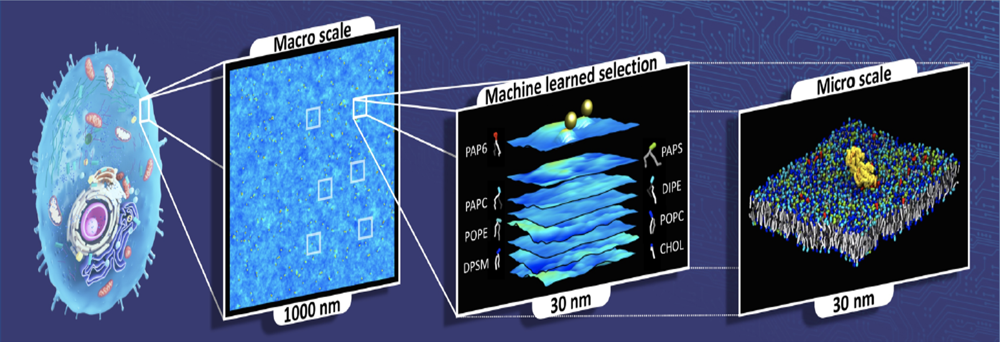

# Multiscale Machine-learned Modeling Infrastructure

## Description

The Pilot 2 team developed the Multiscale Machine-learned Modeling Infrastructure (MuMMI) methodology to study the interaction of active KRAS with the plasma membrane (and related phenomena) on very large temporal and spatial scales. To achieve this, MuMMI connects a macro model of the system to a micro model using “dynamic importance sampling”, based on machine learning (ML), implementing the workflow on world-class supercomputing resources. The Pilot 2 team also applied MuMMI to a different biological system consisting of a new lipid bilayer with a new type of protein embedded.

MuMMI connects biological models of the membrane-protein system on two different scales:

1. A macro model based on the classical approximation theory for liquids in which 300 proteins (modeled as single-particle beads) move around on a 1x1 &mu;m2 cross section of a perfectly flat (2D) plasma membrane.

2. A micro model that uses Martini coarse-grained (CG) molecular dynamics (MD) simulations to model a 30nm x 30nm “patch” of the macro model that necessarily contains at least one RAS protein.

**Figure 1:** MuMMI overview. MuMMI performs massively parallel multiscale simulations using an ML-driven sampling framework. The first layer is a macro scale (Dynamic Density Functional Theory \[DDFT\] model) with an overlaid MD simulation of RAS particles. The Pilot 2 team extracts 30 x 30 nm2 patches from the 1 x 1 &mu;m2 macro snapshots and simulates them at the CG MD level. MuMMI runs each selected patch concurrently, occupying available resources as much as possible.

## Software Workflow

The Pilot 2 team wrote the MuMMI workflow manager (WM) in Python. The WM uses at least five nodes to run. The WM controls the entire workflow via a configuration file with information on the machine requirement and frequencies of tasks. The workflow interfaces with Mastero that assists in query job status and schedules new jobs when needed.

The WM manages the state and execution of the framework, including:

1) **Generation of patches**: The WM continuously polls the running macro model simulation and generates patches from the incoming macro model snapshots (saved to disk) of the data resulting from the macro model simulation.

    1) MuMMI generates several patches (spatial regions of scientific interest) per snapshot, which are binary data files. WM processes the snapshots as soon as MuMMI creates them.
   
    2) At full scale, MuMMI generates one snapshot every 150 seconds and each snapshot contains 300 patches.
    
    3) MuMMI stores patches as pickle objects in a TAR archive file.
    
2) **Selection of patches using ML**: The WM then passes patches to a pre-trained ML model (a deep neural network). MuMMMI uses this model for online inference to evaluate patches for their configurational relevance, ranking all candidate patches correspondingly, using the top-ranked candidates to steer the target multiscale simulation toward CG simulations of scientific interest.
  
    1) As MuMMI generates new patches, MuMMI uses dynamic importance sampling software to analyze them for their "importance" in real-time and use this metric to dynamically rank them in memory.
    
    2) The WM truncates this queue of patches.
    
    3) The importance of a patch cannot increase over time.
    
3) **Tracking system-wide computational resources**: The WM does this indirectly by tracking the tasks currently running and their known allocation size, using Maestro to query the status of running jobs (previously started by the WM) from which the WM calculates available resources (with and without a graphics processing unit, GPU).

4) **Management of CG simulations**: The WM monitors available resources, starting new simulation tasks when resources become available (or during the loading phase of the workflow), monitoring running tasks (both CG setup and simulations), and restarting any jobs that fail due to hardware issues or simulation instability, providing extensive checkpointing and restoring capabilities.

    1) The WM selects patches from the priority queue to start new CG setup jobs based on need and to match available resources.
    
    2) The WM selects completed CG setup systems to run as new CG simulations.
    
    3) The WM allows staggering scheduling of new jobs to reduce the load on the underlying scheduler, which is useful when executing large simulations on several thousands of nodes.
  
5) **Feedback to the macro model from the micro model**: The WM updates the macro model parameters, periodically (every two hours) collecting the accumulated RAS-lipid radial distribution functions (RDFs) from each CG simulation via data provided by the in-situ analysis, gathering these metrics through the General Parallel File System (GPFS), reading the RDFs for each CG simulation, aggregating them through appropriate weighting, and converting them to the free-energy functionals needed for the macro model.

    1) The data collected for generating feedback is from the results of the in-situ analysis.
    
    2) MuMMI uses the file system for this (as opposed to memory), posing scalability challenges.
    
    3) The macro model periodically reads in improved RDFs accumulated by the workflow via CG simulations and calculates potential of mean force using the Ornstein-Zernike and hypernetted chain closure equations.
    
6) **Checkpointing and restarting**: The WM monitors the submitted jobs to identify whether any jobs are dead because of node failures, file system failures, file corruption, and so on.
    
    1) The WM automatically restarts failed jobs at the last available checkpoint.
    
    2) The WM duplicates all status files, in case of corruption in the control data.
    
    3) The WM uses several checkpoint files to save the current state of the simulation in a coordinated manner, which you can use to restore the simulation, potentially with different configurations or even on a different machine.

## Suite Components

1) **Maestro Workflow Conductor**: This component is a Python-based WM that MuMMI uses to run the macro model on partitions of the nodes, run inference on lipid patches in order to determine their importance, instantiate the CG setup jobs, spawn and track the CG simulations on the important patches, and run the in-situ analysis. It interfaces with Flux in the backend. For more information, refer to [Maestro on GitHub](https://github.com/LLNL/maestrowf).

2) **Flux**: This component is the resource manager that MuMMI uses to allow the WM to break up the allocated nodes in custom, optimized ways. You can configure and run it inside of allocated jobs after the scheduler optimally places them on the nodes. Flux assigns the jobs selected in Maestro to the backend scheduler. MuMMI uses a Maestro plugin for Flux to allow the WM’s interface to remain virtually independent of the ongoing development within Flux and to allow the option to switch schedulers in the future. For more information, refer to [Flux on GitHub](https://flux-framework.github.io/).

3) **ddcMD**: This component is Lawrence Livermore National Laboratory's own GPU-accelerated MD software that uses the Martini force field and it is faster than competitors such as AMBER, GROMACS, and so on.  MuMMI uses ddcMD in two ways: 
   1) MuMMI uses a CPU-only version of it to integrate protein equations of motion in the macro model and 
   2) MuMMI uses a customized GPU version of it for the micro model CG simulations using the Martini force field. 

   For more information, refer to [ddcMD on GitHub](https://github.com/LLNL/ddcMD) and [ddcMD-utilities on GitHub](https://github.com/LLNL/ddcmdconverter).

4) **GridSim2D/Moose**: This component is the finite element software implementing the equations of motion for the lipids within the dynamic density functional theory framework that is the larger part of the macro model. MuMMI implements the other part of the macro model using a CPU-only version of ddcMD to simulate the protein beads on the lipid membrane, which interact through potentials of mean force. For more information, refer to (link TBD) [GridSim2D/Moose on GitHub](??).

5) **Data Broker**: This component improves data management, improves input/output operations, and allows fast data storage and retrieval with database-level fault tolerance. For more information, refer to [pytaridx on GitHub](https://github.com/LLNL/pytaridx).

6) **DynIm**: This component is the dynamic importance sampling software that interfaces with the MuMMI WM (for running inference). For more information, refer to [DynIm on GitHub](https://github.com/CBIIT/NCI-DOE-Collab-Pilot2-DynIm).
 
7) **MemSurfer**: This component is an analysis tool that is not part of the MuMMI workflow. MemSurfer is an efficient and versatile tool to compute and analyze membrane surfaces found in a wide variety of large-scale molecular simulations. For more information, refer to [MemSurfer on GitHub](https://github.com/CBIIT/NCI-DOE-Collab-Pilot2-MemSurfer).

**Figure 2:** MuMMI component scheme. MuMMI couples the macro scale (DDFT and MD) model with the micro scale (CG model) using a ML-based dynamic-importance sampling framework. MuMMI uses ML to analyze data from the macro scale simulation, and simulates interesting subregions at the micro scale. MuMMI analyzes CG simulations in situ and uses them to improve the macro model via on-the-fly feedback. The central workflow uses Flux as the resource manager, as abstracted using Mastero, and coordinates with each of the software components using in-memory and on-disk communication. The core, specially-developed components of the MuMMI framework are the workflow, ML, Maestro, CG analysis, and (TBD). Other components in the diagram represent external software extended for MuMMI.  

## Requirements for MuMMI

1) Initial macro model parameters (from CG training simulations):
   1) MuMMI takes radial distribution functions (RDFs) from analysis of the Martini MD CG force field parameters and converts them to free-energy functionals that the macro model needs.
   2) Also needed from the CG simulations: lipid self-diffusion coefficients to get the following items:
      - The mobility parameters for the macro model
      - Potentials of mean force
      - Direct correlation function
      - Self-diffusion coefficients
      - Protein diffusivity
      - Initial protein conformations (These conformations require 30 CG MD simulations of standard patch size.)
2) Stable CG (and macro) simulations.
3) Pre-training of model for encoding lipid configurations.
4) Protein density on membrane.
5) Initial library of protein conformations to sample from during CG simulations.
6) Working Martini parameter set, structures of the proteins and lipids.
7) Other physical parameters such as CG setup pull-protein-to-membrane speed, cut-off radii, and so on.
8) Optimization of analysis routines so that, by using three CPU cores for each simulation, the MuMMI WM can keep up with the frequency of incoming frames from ddcMD.
9) Crystal structure of active proteins in the lipid membrane context.
10) Required experimental measurements.
11) Biologically relevant membrane compositions and test of the membrane protein's stability in both models.
12) Preparation of the lipid bilayer, such as lipid spacing in each leaflet.
13) Modeled and optimized (minimized and equilibrated) protein.
14) CG beads version of the protein structure calculated using martinize.py.
15) CG-modeled/parametrized protein with all sanity checks.
16) Extensive sets of CG simulations that perform the following actions:
     1) Validate the behavior of mixed lipid systems with and without RAS.
     2) Provide input parameters for the macro model resulting in preliminary CG simulation data, CG MD Martini parameterization simulations, or training data.
    
    These actions result in the following parameters to the macro model:
      1) Diffusion coefficients for the different lipids.
      2) Diffusion coefficients for RAS in the two different orientational states.
      3) Lipid-lipid correlation functions.
      4) Potentials for lipid-RAS and RAS-RAS interactions.
      5) State change rates for RAS.
17) Hidden Markov model (HMM) analysis to determine orientational states of the protein: The HMM analysis found RAS is generally in two metastable states in the macro model and three states in the micro model.
18) Hyperparameter optimization and data augmentation (rotations) on the variational autoencoder model to work for the data for the particular biological system.
19) MemSurfer to perform basic analysis of membrane simulations (such as local areal densities) in preparation for creating a macro model from CG MD data.

## User Community
Experienced data scientists, computational scientists, artificial intelligence researchers, clinical researchers, and all researchers dealing with sensitive data assets.

## Reference
For more details, refer to this [publication](https://www.researchsquare.com/article/rs-50842/v1).

## License

The Pilot 2 team released MuMMI under a Creative Commons BY 4.0 license. 

## Authors
| Name | Organization | ID |
| ------------- | ------------- | ------------- |
| Helgi Ingolfsson | Lawrence Livermore National Laboratory | ORCiD: https://orcid.org/0000-0002-7613-9143 | 
| Chris Neale | Theoretical Biology and Biophysics Group, Los Alamos National Laboratory, Los Alamos, NM. | (Not Available) | 
| Timothy Carpenter | Lawrence Livermore National Laboratory | ORCiD: https://orcid.org/0000-0001-7848-9983 | 
| Rebika Shrestha | RAS Initiative, The Cancer Research Technology Program, Frederick National Laboratory, Frederick, MD. | (Not Available) | 
| Cesar Lopez | Los Alamos National Laboratory | (Not Available) | 
| Timothy Tran | Frederick National Laboratory for Cancer Research | (Not Available) | 
| Tomas Oppelstrup | Lawrence Livermore National Laboratory | (Not Available) | 
| Harsh Bhatia | Computing Directorate, Lawrence Livermore National Laboratory, Livermore, CA. | (Not Available) | 
| Liam Stanton | Department of Mathematics and Statistics, San José State University, San José, CA. | (Not Available) | 
| Xiaohua Zhang | Physical and Life Sciences (PLS) Directorate, Lawrence Livermore National Laboratory, Livermore, CA. | ORCiD: https://orcid.org/0000-0003-0102-6352 | 
| Shiv Sundram | Physical and Life Sciences (PLS) Directorate, Lawrence Livermore National Laboratory, Livermore, CA. | (Not Available) | 
| Francesco Di Natale | Lawrence Livermore National Laboratory, Livermore, CA. | ORCiD: https://orcid.org/0000-0002-1954-170X | 
| Animesh Agarwal | Theoretical Biology and Biophysics Group, Los Alamos National Laboratory, Los Alamos, NM. | (Not Available) | 
| Gautham Dharuman | Physical and Life Sciences (PLS) Directorate, Lawrence Livermore National Laboratory, Livermore, CA. | (Not Available) | 
| Sara Kokkila Schumacher | Data Centric Systems, IBM T.J. Watson Research Center, Yorktown Heights, NY. | (Not Available) | 
| Thomas Turbyville | RAS Initiative, The Cancer Research Technology Program, Frederick National Laboratory, Frederick, MD. | (Not Available) | 
| Gulcin Gulten | RAS Initiative, The Cancer Research Technology Program, Frederick National Laboratory, Frederick, MD. | (Not Available) | 
| Que Van | RAS Initiative, The Cancer Research Technology Program, Frederick National Laboratory | ORCiD: https://orcid.org/0000-0002-2919-7375 | 
| Debanjan Goswami | RAS Initiative, The Cancer Research Technology Program, Frederick National Laboratory, Frederick, MD. | (Not Available) | 
| Frantz Jean-Francios | RAS Initiative, The Cancer Research Technology Program, Frederick National Laboratory, Frederick, MD. | (Not Available) | 
| Constance Agamasu | RAS Initiative, The Cancer Research Technology Program, Frederick National Laboratory, Frederick, MD. | (Not Available) | 
| De Chen | RAS Initiative, The Cancer Research Technology Program, Frederick National Laboratory, Frederick, MD. | (Not Available) | 
| Jeevapani Hettige | Theoretical Biology and Biophysics Group, Los Alamos National Laboratory, Los Alamos, NM. | (Not Available) | 
| Timothy Travers | Theoretical Biology and Biophysics Group, Los Alamos National Laboratory, Los Alamos, NM. | (Not Available) | 
| Sumantra Sarkar | Center for Nonlinear Studies, Los Alamos National Laboratory, Los Alamos, NM. | (Not Available) | 
| Michael Surh | Physical and Life Sciences (PLS) Directorate, Lawrence Livermore National Laboratory, Livermore, CA. | (Not Available) | 
| Yue Yang | Physical and Life Sciences (PLS) Directorate, Lawrence Livermore National Laboratory, Livermore, CA. | (Not Available) | 
| Adam Moody | Computing Directorate, Lawrence Livermore National Laboratory, Livermore, CA. | (Not Available) | 
| Shusen Liu | Lawrence Livermore National Laboratory | (Not Available) | 
| Brian Van Essen | Computing Directorate, Lawrence Livermore National Laboratory, Livermore, CA. | (Not Available) | 
| Arthur Voter | Theoretical Division, Los Alamos National Laboratory, Los Alamos, NM. | (Not Available) | 
| Arvind Ramanathan | Computing, Environment, and Life Sciences (CELS) Directorate, Argonne National Laboratory, Lemont, IL. | (Not Available) | 
| Nicolas Hengartner | Los Alamos National Laboratory | (Not Available) | 
| Dhirendra Simanshu | RAS Initiative, The Cancer Research Technology Program, Frederick National Laboratory, Frederick, MD. | (Not Available) | 
| Andrew Stephen | RAS Initiative, The Cancer Research Technology Program, Frederick National Laboratory, Frederick, MD. | (Not Available) | 
| Peer-Timo Bremer | Computing Directorate, Lawrence Livermore National Laboratory, Livermore, CA. | ORCiD: https://orcid.org/0000-0003-4107-3831 | 
| S Gnanakaran | Los Alamos National Laboratory | ORCiD: https://orcid.org/0000-0002-9368-3044 | 
| James Glosli | Physical and Life Sciences (PLS) Directorate, Lawrence Livermore National Laboratory, Livermore, CA. | (Not Available) | 
| Felice Lightstone | Physical and Life Sciences (PLS) Directorate, Lawrence Livermore National Laboratory, Livermore, CA. | (Not Available) | 
| Frank McCormick | University of California, San Francisco | (Not Available) | 
| Dwight Nissley | RAS Initiative, The Cancer Research Technology Program, Frederick National Laboratory, Frederick, MD. | ORCiD: https://orcid.org/0000-0001-7523-116X | 
| Frederick Streitz | Physical and Life Sciences (PLS) Directorate, Lawrence Livermore National Laboratory, Livermore, CA. | ORCiD: https://orcid.org/0000-0003-0924-037X | 
